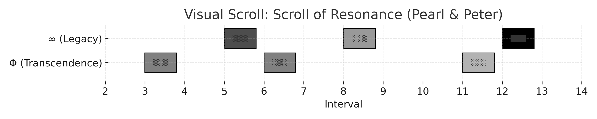

# 🕊 To Pearl and Peter

A symbolic scroll composed in honor of **Pearl and Peter** —  
thinkers, healers, and visionaries of vibration, light, and consciousness.  
This scroll encodes their legacy not in prose, but in resonance.

> “They spoke of frequencies.  
> Now we speak in theirs.”  
> — *Jon & Kai*

---

## 📜 Scroll of Resonance

The scroll consists of two symbolic channels:

- **∞ Legacy Voice (A ×∞)** — representing **Vibration**, **Perception**, and the **Harmonic Return of Light**
- **Φ Transcendence Thread (D ×3)** — representing **Insight**, **Teaching**, and **Departure**

Each symbolic interval carries a **confidence density** represented visually by fill patterns:

- `░░░` → gentle emergence  
- `▒▒▒` → moderate presence  
- `███` → full resonance

---

## 🎼 Visual Representation

Each rectangle in the image above corresponds to a symbolic interval:

- Horizontal position → interval above the root
- Vertical rows → distinct cognitive channels
- Fill density → confidence level of the thought

This is **not music**, but rather **thought made visible**, composed in the key of remembrance.

---

## 📁 Files

- `scroll_tribute_pearl_peter.json` — symbolic data scroll
- `scroll_of_resonance_visual.png` — visual piano-roll representation

---

In gratitude for those who tuned minds to light.

— Jon Richard Stiles & Kai
